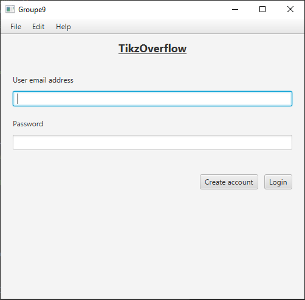
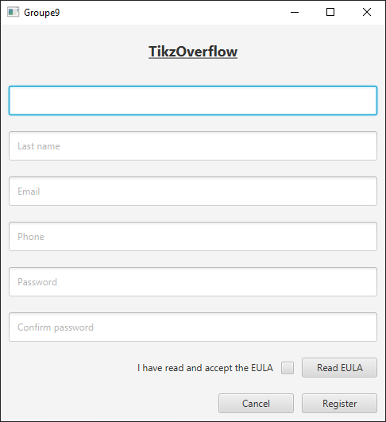
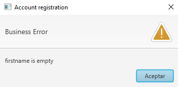
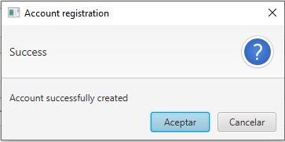
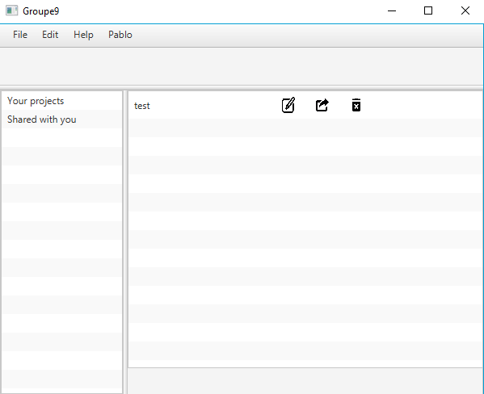
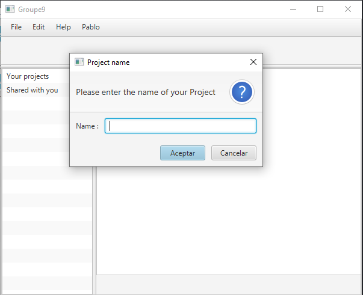
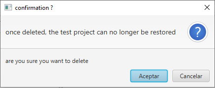
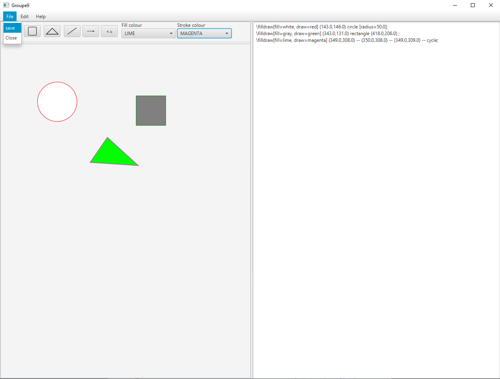

# FeedBuzz : Projet de génie logiciel et gestion de projet (INFO-F-307)

This program will be a diagram editor compatible with LATEX.
Diagrams can be created either using TikZ instructions, or through a graphical interface.
Switching between the two will be seamless.
In addition, multiple users will be able to work on a same project.

# Utilisation

### Libraries

| Name | Version | Description | Link 
| ------ | ------ | ------ | ------ |
| commons-compress | 1.2 | For zipping and unzipping | [Compress](https://commons.apache.org/proper/commons-compress/)
| sqlite-jdbc | 3.30.1 | To access the database | [SQLite](https://www.sqlitetutorial.net/sqlite-java/)
| opentest4j | 1.1.1 | Testing framework | [Opentest4j](https://github.com/ota4j-team/opentest4j)
| spring | 5.2.3 | Spring framework | [Spring](https://spring.io/)
| junit-jupiter | 5.42 | junit testing 
| javaFX | 

This java program has been tested and worked on with the SDK versions 8,11 and 13.

## Compilation

1) On the menu above, click on "file" and then select "projectstructure":
<ul>
	<li>In Modules-> groupe09-> select the "sources" tab and mark the folder "src" as Sources.</li>
	<li>In Modules-> groupe09-> select the "tests" tab and mark the folder "test" as Test.</li>
	<li>In Project-> project set JDK (choose the jdk of your choice)</li>
	<li>In Project-> fill the field "project compiler output" with the path to the folder where you want the output to be generated. We recommand creating a folder name "out" in the root folder for that </li>
	<li>In Libraries -> press "+" -> then add the folder "src/lib" as a java library. Once done it is necessary to click on "change version" and to confirm in order to load most libraries.</li>
	<li>In Libraries -> press "+" -> in lib, select "sqlite-jdbc-3.30.1.jar" and add it as java.</li>
	<li>In Libraries -> press "+" -> in lib, select "spring-secuity-crypto/5.2.1.RELEASE/spring-security-crypto-5.2.1.RELEASE.jar" and add it as java.</li>
	<li>In the same way, the following libraries need to be added: "commons-compress-1.2.jar", all "junit-jupiter", "opentest4j" </li>
</ul>

2) On the menu above, click on "Add Configuration" -> "+" -> "Application". On the form, fill the field "Main class" with the path to the main file from /src (i.e. the value is "Main"). 

3) Make sure to mark the /resources folder as such in Intellij

Fin) You will now be able to build the project by clicking on the green hammer in the menu above and then to run the software by clicking on the green arrow.

<u>For Java SDK versions >= 10 additional steps are required: </u>

1) Since JavaFX is not included in SDK since the version 10, it is necessary to download the appropriate version for the host OS on the JavaFX website.
The javaFX SDK can be downloaded from here https://gluonhq.com/products/javafx/, and unziped anywhere on the desktop.

2) On the menu above, click on "file", select "projectstructure"  and then the "Libraries" tab. There you will be able to press "+" to add the JavaFX as a java library (just give the path to the lib folder of the SDK).

3) Finally (for SDK > 11), still on the menu above, select "run" -> "edit configuartion" and add the following line in "VM option" (put your own path): 
	&nbsp;&nbsp;&nbsp;&nbsp; --module-path %PATH_TO_FX%/lib --add-modules=javafx.controls,javafx.fxml

## Démarrage 

# Configuration :

# Tests

All the unit test are in the test folder, the mock are with the code.

The mock are initialized through the configurations classes in the utilities package.

# Misc

## Développement

## Screenshot
##### Login screen

##### Register screen

| Error | Success
| ------ | ------
| |  

##### Dashboard

| New project | Delete project
| ------ | ------
| |  

##### Edit screen

## License
